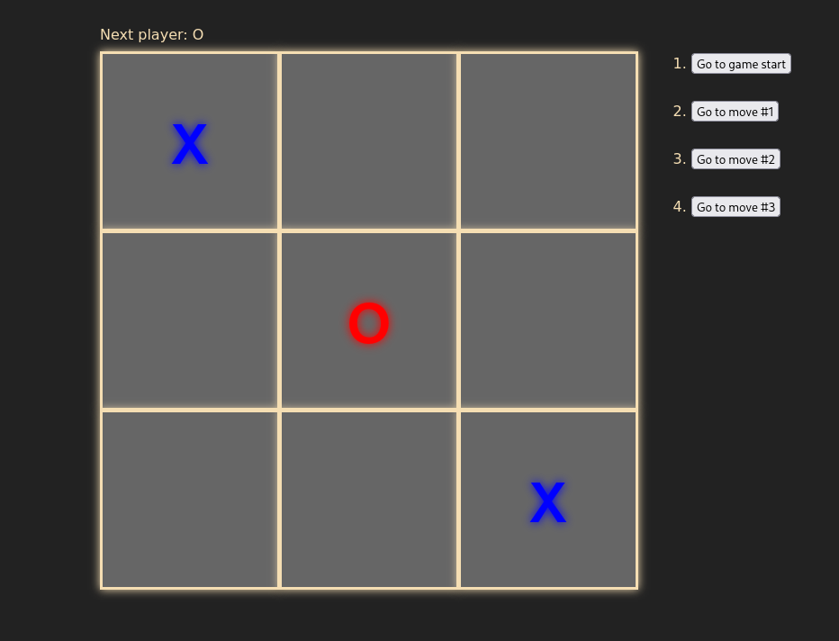
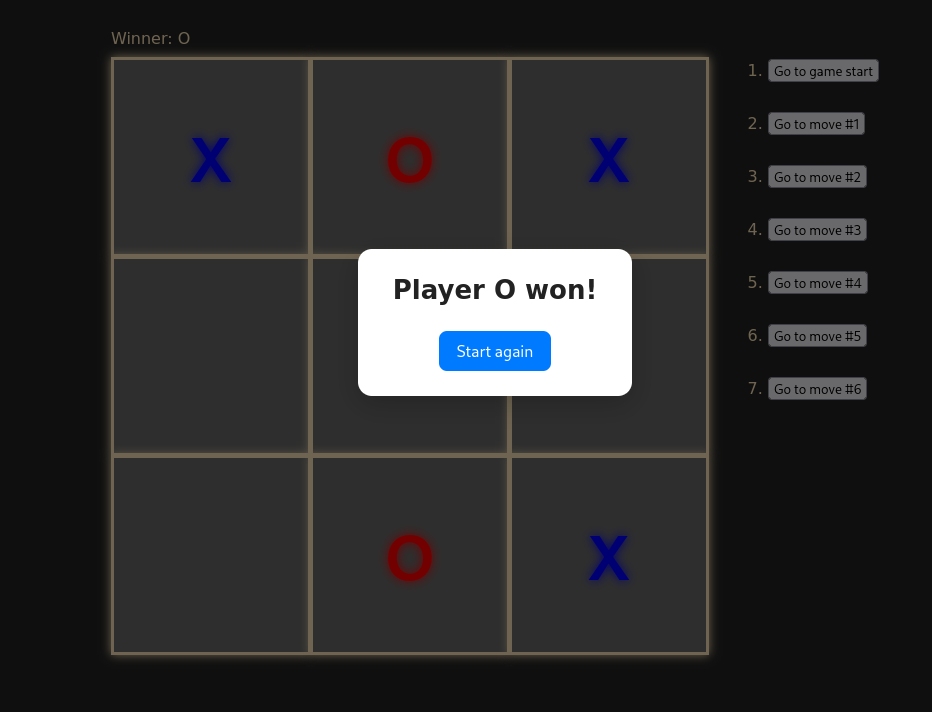

🕹️ Tic Tac Toe — React Version

A simple, clean, and interactive Tic Tac Toe game built using React.
This project demonstrates essential React concepts like state management, props, lifting state up, conditional rendering, modals, and component reusability.

if you want to test it:
https://tic-tac-toe-by-azimovdev.vercel.app/

🚀 Features

🎯 Classic 3×3 Tic Tac Toe gameplay

👨‍💻 Built entirely with React functional components

🔄 “Start Again” button to restart the game instantly

🏆 Displays the winner with a pop-up modal

🤝 Detects draw situations

⚡ Smooth UI updates using React state

🧩 Clean and modular code structure

📱 Responsive layout

🛠️ Technologies Used

React (Vite or CRA)

JavaScript (ES6+)

CSS3 for styling

ReactDOM.createPortal for modal rendering

📂 Project Structure

src/
│── components/
│ ├── Board.jsx
│ ├── Game.jsx
│ ├── Modal.jsx
│ └── Square.jsx
│── App.css
│── App.jsx
│── index.css
│── main.jsx

🎮 How to Play

1. Click any square on the board to place your move.
2. Players alternate between X and O.
3. The game automatically detects:
   A winner
   A draw

4. When someone wins, a modal appears showing:
   Player X won!
   or
   Player O won!

5. Click "Start Again" to restart the game.

▶️ Running the Project

1. Install dependencies
   npm install

2. Run the development server
   npm run dev

3. Open in browser
   Visit:
   http://localhost:5173 or (or whatever Vite shows).

📸 Screenshot

📝 Learning Purpose

1. This project is perfect for practicing:
   Component structure in React
   Passing props
   Managing state (useState)
   Using useEffect for side effects
   Rendering modals with portals
   Basic game logic

📄 License
MIT — feel free to use, modify, and share!
